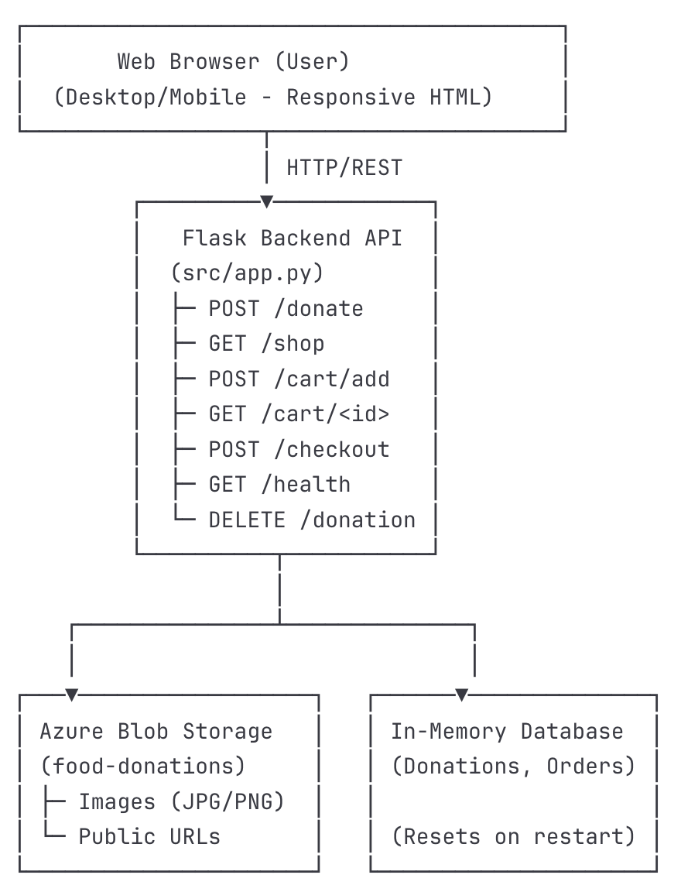
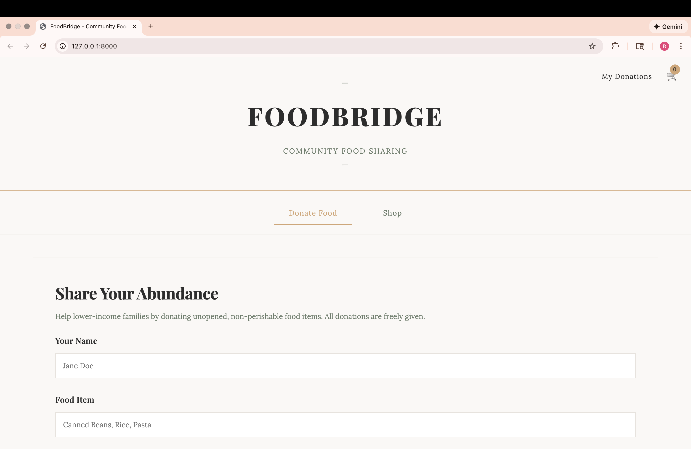
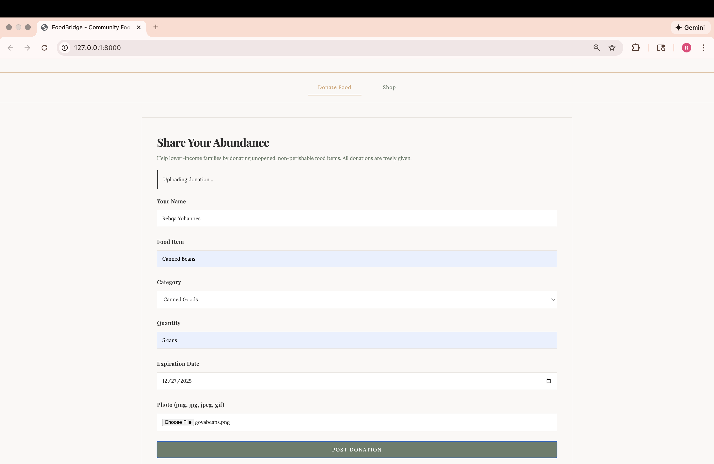
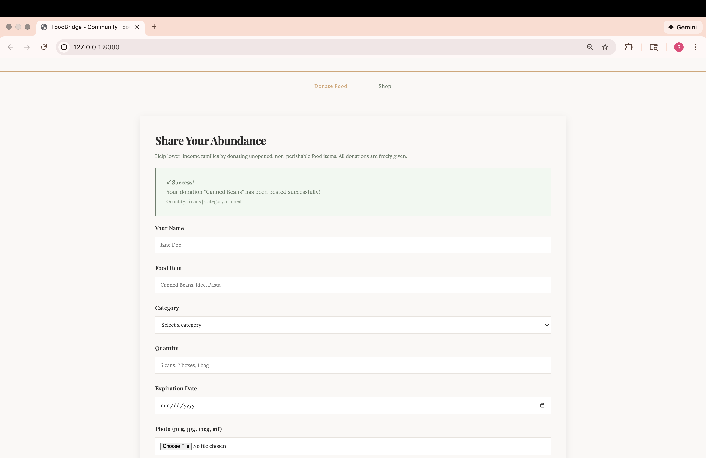
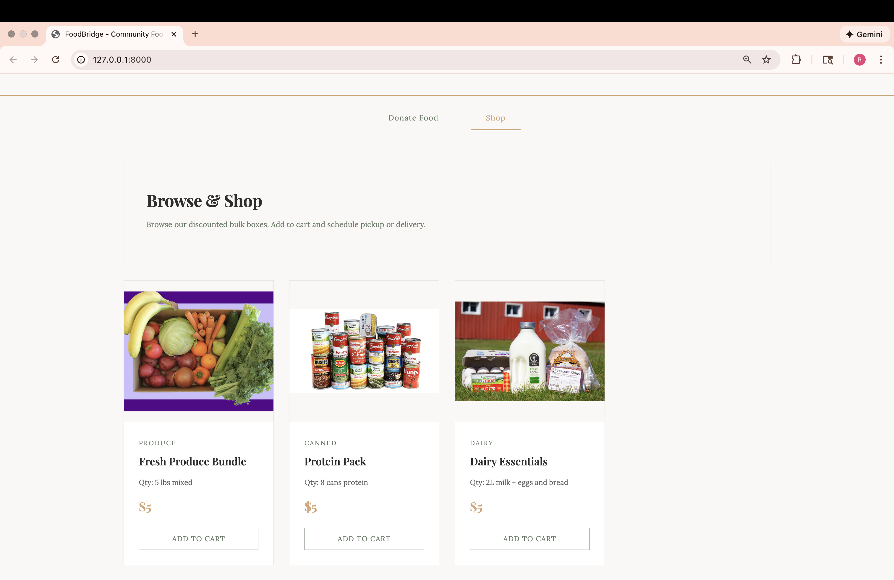
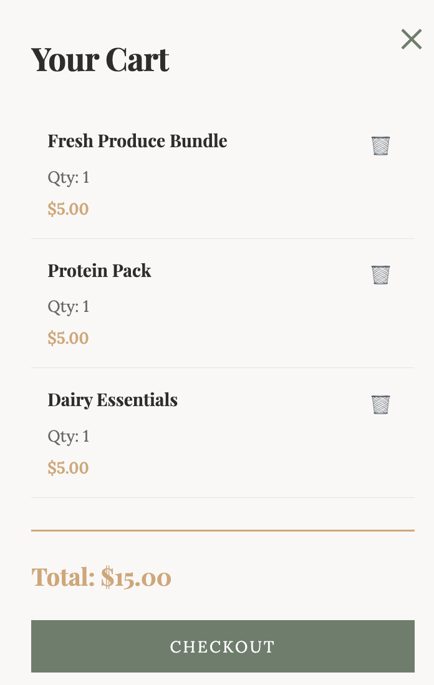
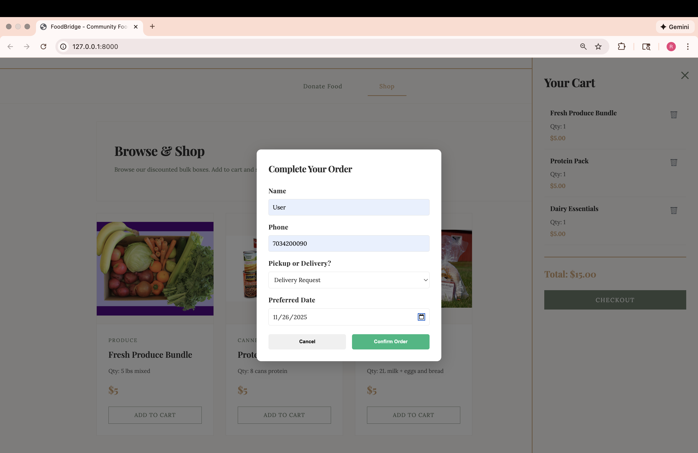
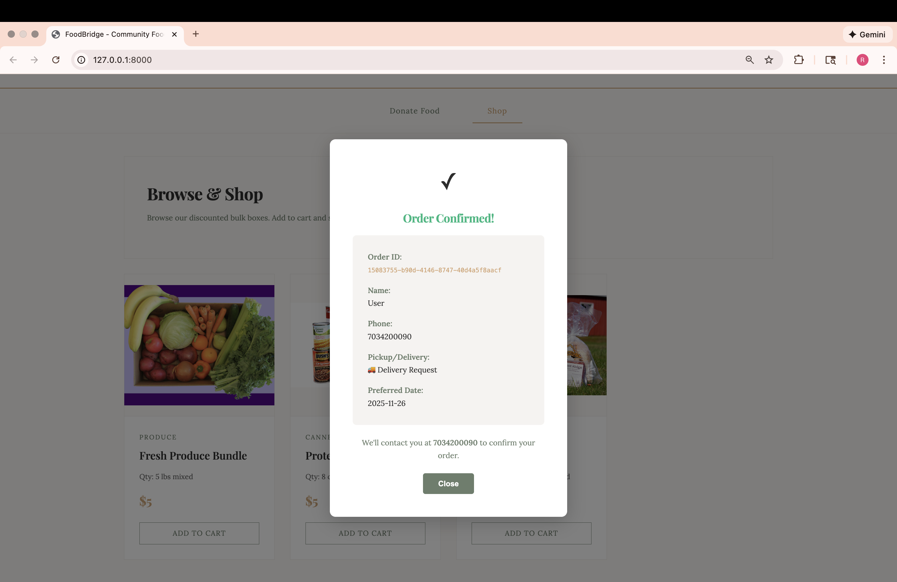

# FoodBridge: Community Food Sharing Platform  
*DS2022 - Final Case Study*  
*Author: Rebqa Yohannes*

---

## 1) Executive Summary

**Problem:** 

Food insecurity affects millions of families while thousands of unopened, perfectly safe food items are thrown away because donors lack an easy platform to give them away. Traditional food banks do not provide real-time visibility into available donations, creating a disconnect between willing donors and recipients in need.


**Solution:** 

FoodBridge is a full-stack, containerized web platform that connects donors with lower-income recipients in real time. Donors upload food items—including photos, categories, quantities, and expiration dates—and recipients browse available items, add them to a cart, and schedule pickup or delivery. The system demonstrates core cloud-native concepts including Flask REST APIs, Docker-based reproducibility, and Azure Blob Storage for scalable image hosting.

---

## 2) System Overview

FoodBridge implements a real-time donation workflow that allows donors to share surplus food and recipients to access free items through an intuitive web interface.

### Key System Capabilities
- **Donor portal** for uploading items with images  
- **Recipient shopping experience** with cart + checkout  
- **Backend REST API** to manage donations and orders  
- **Optional cloud deployment** on Azure App Service  

---

## Course Concepts Implemented

### **Flask REST API (Week 5 Module - Cloud Computing)**
- Implemented endpoints for donation, browsing, cart operations, checkout, and health checking
- Returned structured JSON responses
- Included input validation and descriptive error handling  

### **Azure Blob Storage Integration (Week 7 Module - Blob Storage)**
- Stored uploaded donor images in a public-read blob container
- Generated public URLs for frontend display
- Loaded connection strings securely from environment variables

### **Docker Containerization (Weeks 10-11 Module - Docker)**
- Built a deterministic Docker image using a production-ready Dockerfile
- Ensured consistent environment across local + cloud deployments
- Single-command run via `docker run --rm -p 8000:8000 --env-file .env foodbridge:latest`

---
## System Architecture Diagram


### Data, Services & Artifacts

| Component | Description | Format | Notes |
|----------|-------------|--------|-------|
| Donation metadata | Item name, category, quantity, expiration | JSON (in-memory) | Fast, demo-friendly |
| Item images | Uploaded by donors | JPG/PNG | Stored in Azure Blob Storage |
| Flask backend | REST API | Python | Handles all core logic |
| Frontend | HTML, CSS, JS | Static | Calls REST endpoints |
| Container | Docker image | ~250MB | Reproducible environment |

---
# 3) How to Run (Local)

FoodBridge is fully containerized.  
**The required reproducible run uses Docker.**

### Docker (Required)

```bash
# build image
docker build -t foodbridge:latest .

# run container
docker run --rm -p 8000:8000 --env-file .env foodbridge:latest

# health check
curl http://localhost:8000/api/health
```
*Optional: Run locally without Docker*

```bash
chmod +x run.sh
./run.sh # -> Running on http://127.0.0.1:8000
```
---
# 4) Design Decisions

## Why Flask + Azure Blob + Docker?
- Flask provides a lightweight, minimal framework ideal for building a clean, educational REST API.  
- Azure Blob Storage enables scalable, reliable hosting for user-uploaded images.  
- Docker ensures identical behavior in development and production, eliminating OS differences and dependency issues.  
- These tools together model a real-world cloud-native pipeline while remaining accessible for an MVP.

---

## Alternatives Considered

| Component | Alternative | Why Not Used |
|-----------|-------------|-------------|
| In-memory storage | PostgreSQL | Adds unnecessary complexity for an MVP; no persistence required |
| Azure Blob | AWS S3 | Azure is the course-standard platform |
| Flask | FastAPI | Overkill for simple routing + file uploads |
| Docker | Manual Python venv | Non-reproducible, inconsistent across machines |

---

## Tradeoffs

| Area | Benefit | Limitation |
|-------|---------|------------|
| In-memory DB | Fast, simple, ideal for demo | Data resets on container restart |
| No authentication | Easier UX and reduces scope | No user verification or roles |
| Optional cloud deployment | Saves cost | Requires manual setup for scaling |

---

## Security, Privacy & Ops

- Secrets stored only in `.env` (never committed to GitHub).  
- Strict file validation for uploads (image-only + max file size).  
- No sensitive PII stored; only donor name and item information collected.  
- Logging handled by Flask + Docker stdout; Azure App Service supports log streaming.  
- `/api/health` endpoint serves as a built-in uptime + monitoring check.

---

# 5) Results & Evaluation

## Screenshots

**Homepage**
  

**Donation Form**
  

**Success Message**


**Shop Gallery**
 

**Cart Modal**
  

**Checkout Form**
  

**Order Confirmation**


---

## Functional Validation

- Successfully upload donation items + images  
- Images stored in Azure Blob and displayed publicly  
-`/api/shop` returns available items in real time  
- Users can add items to a cart and checkout  
- API fully operational inside Docker container  
- `/api/health` consistently returns OK status  

---

## Edge Case Handling

- Missing required fields → proper `400 Bad Request`  
- Invalid file types rejected with descriptive error message  
- Image upload size capped to prevent abuse  
- Cart cannot be checked out while empty  
- Invalid donation IDs return meaningful `404` responses  

---

## Performance & Resource Footprint

- API response time: **50–100 ms**  
- Image upload time: **1–3 seconds**  
- Docker cold start: **3–5 seconds**  
- Memory usage: **~50–100 MB**  
- Suitable for **50–100 concurrent demo users**  

---

## Automated Test (Smoke Test)

File: `tests/health.py`

```python
import requests

def test_health():
    r = requests.get("http://localhost:8000/api/health")
    assert r.status_code == 200
    assert r.json()["ok"] is True
```

Run with:
```bash
pytest -q
```

# 6) What’s Next

### Short-Term Improvements
- Add PostgreSQL for persistent storage  
- Implement user authentication (donor + recipient accounts)  
- Add email notifications for donation confirmations and order updates  

### Medium-Term Enhancements
- Implement full-text search and advanced filtering  
- Build a donation analytics dashboard (items donated, category trends, impact metrics) 
- Add a donor reputation or badges system  

### Long-Term / Stretch Goals
- Mobile app (iOS + Android)  
- Integrations with local food banks and shelters through public APIs  
- Barcode scanning for automatic item/expiration extraction  
- AI-powered personalized item recommendations for recipients  

---

# 7) Links (Required)

**GitHub Repository:**  
https://github.com/rebqay/final-case

**Public Cloud Deployment (Optional Extra Credit):**  
https://foodbridge-gthjfjddbcdwcvhc.westus3-01.azurewebsites.net

**Health Endpoint:**  
https://foodbridge-gthjfjddbcdwcvhc.westus3-01.azurewebsites.net/api/health

---

# Repo Structure
```
FinalCase/
├── .github/
│   └── workflows/
│       └── main_foodbridge.yml
├── assets/
│   ├── architecturedg.png
│   ├── cartcheckout.png
│   ├── cartmodal.png
│   ├── donationform.png
│   ├── homepage.png
│   ├── orderconfirmed.png
│   ├── shopgallery.png
│   └── successmessage.png
├── src/
│   ├── __pycache__/
│   └── app.py
├── templates/
│   └── index.html
├── tests/
│   └── health.py
├── uploads/
│   ├── bulk/
│   │   ├── dairy_bundle.jpg
│   │   ├── produce_bundle.jpg
│   │   └── protein_pack.jpg
│   └── [user uploads]
├── venv/
├── .env.example
├── .gitignore
├── application.py
├── Dockerfile
├── LICENSE
├── README.md
├── requirements.txt
└── run.sh
```

